# Screen Flow Overview

## Project Info

- **Project Name**: SAA 2025 — Sun Annual Awards 2025
- **Figma File Key**: `9ypp4enmFmdK3YAFJLIu6C`
- **Figma URL**: https://www.figma.com/design/9ypp4enmFmdK3YAFJLIu6C
- **MoMorph URL**: https://momorph.ai/files/9ypp4enmFmdK3YAFJLIu6C
- **Created**: 2026-05-14
- **Last Updated**: 2026-05-14

---

## Discovery Progress

| Metric | Count |
|--------|-------|
| Total Screens (primary UI) | 7 |
| Discovered | 7 |
| Remaining | 0 |
| Completion | 100% |

> Note: The Figma file contains many component/overlay frames. The table below lists only **primary route screens** (full-page views and their inline overlays that have navigational significance). Component frames (buttons, dropdowns, icons, etc.) are excluded.

---

## Screen Inventory

| # | Screen Name | Frame ID | Route | Spec Status | Spec File | Predicted APIs | Navigates To |
|---|-------------|----------|-------|-------------|-----------|----------------|--------------|
| 1 | Login | `GzbNeVGJHz` | `/login` | Spec Created (Reviewed v2) | `.momorph/contexts/specs/GzbNeVGJHz-Login/spec.md` | `supabase.auth.signInWithOAuth`, `GET /auth/callback` | `/` (post-login), `/login?error=auth_failed` |
| 2 | Homepage SAA | `i87tDx10uM` | `/` | Spec Created | _(pending)_ | `GET /api/awards`, `GET /api/countdown`, `GET /api/kudos/feed` | `/awards-information`, `/awards-information#{slug}`, `/sun-kudos`, `/auth/callback` (logout redirect) |
| 3 | Hệ thống giải (Awards Information) | `zFYDgyj_pD` | `/awards-information` | Spec Created | _(pending)_ | `GET /api/awards` | `/`, `/awards-information#{slug}` |
| 4 | Sun* Kudos — Live Board | `MaZUn5xHXZ` | `/sun-kudos` | Spec Created | _(pending)_ | `GET /api/kudos`, `POST /api/kudos` | `/`, `/sun-kudos/write` |
| 5 | Viết Kudo (Write Kudo) | `ihQ26W78P2` | `/sun-kudos/write` | Spec Created | _(pending)_ | `POST /api/kudos`, `GET /api/users/search` | `/sun-kudos` |
| 6 | Open Secret Box | `J3-4YFIpMM` | `/secret-box` | Spec Created | _(pending)_ | `GET /api/secret-box`, `POST /api/secret-box/open` | `/` |
| 7 | Countdown / Pre-launch | `8PJQswPZmU` | `/` _(pre-launch state)_ | Design only | _(pending)_ | `GET /api/countdown` | _(holds until launch)_ |
| — | Auth Callback | _(non-UI)_ | `/auth/callback` | _(route handler)_ | See Login spec | `exchangeCodeForSession`, `profiles.upsert` | `/` (success), `/login` (error/cancel) |
| — | Dropdown Profile | `z4sCl3_Qtk` | _(overlay on `/`)_ | Spec Created | _(pending)_ | `supabase.auth.signOut` | `/` (close), `/login` (sign out) |
| — | Dropdown Profile Admin | `54rekaCHG1` | _(overlay on `/`)_ | Spec Created | _(pending)_ | `supabase.auth.signOut` | `/` (close), `/admin`, `/login` (sign out) |
| — | Error 403 | `T3e_iS9PCL` | `/403` | Design only | _(pending)_ | — | `/` |
| — | Error 404 | `p0yJ89B-9_` | `/404` | Design only | _(pending)_ | — | `/` |
| — | Admin Overview | `9ja9g9iJLW` | `/admin` | Design only | _(pending)_ | `GET /api/admin/stats` | `/admin/content`, `/admin/users`, `/admin/settings` |
| — | Admin Review Content | `MTExSUSdUn` | `/admin/content` | Design only | _(pending)_ | `GET /api/admin/kudos` | `/admin` |
| — | Admin Users | `-u1lKib0JL` | `/admin/users` | Design only | _(pending)_ | `GET /api/admin/users` | `/admin` |
| — | Admin Settings | `fTCVEC9aV_` | `/admin/settings` | Design only | _(pending)_ | `GET /api/admin/settings` | `/admin` |

---

## Navigation Graph

```mermaid
flowchart TD
    subgraph Public["Public (unauthenticated allowed)"]
        Login["Login\n/login"]
        Homepage["Homepage SAA\n/"]
        Awards["Awards Information\n/awards-information"]
        AwardDetail["Award Detail\n/awards-information#{slug}"]
        Countdown["Pre-launch Countdown\n/ (pre-launch state)"]
    end

    subgraph Auth["Auth Flow (non-UI)"]
        Google["Google OAuth\n(external)"]
        Callback["/auth/callback\nroute handler"]
    end

    subgraph Authenticated["Authenticated Users"]
        Kudos["Sun* Kudos Live Board\n/sun-kudos"]
        WriteKudo["Viết Kudo\n/sun-kudos/write"]
        SecretBox["Open Secret Box\n/secret-box"]
        DropdownProfile["Dropdown Profile\n(overlay on /)"]
    end

    subgraph Admin["Admin Only"]
        AdminOverview["Admin Overview\n/admin"]
        AdminContent["Review Content\n/admin/content"]
        AdminUsers["Admin Users\n/admin/users"]
        AdminSettings["Admin Settings\n/admin/settings"]
        DropdownAdmin["Dropdown Profile Admin\n(overlay on /)"]
    end

    subgraph Errors["Error Pages"]
        E403["403 Access Denied\n/403"]
        E404["404 Not Found\n/404"]
    end

    %% Auth flow
    Login -->|"Click LOGIN With Google"| Google
    Google -->|"OAuth redirect"| Callback
    Callback -->|"success: code exchanged"| Homepage
    Callback -->|"error != access_denied"| Login
    Callback -->|"access_denied"| Login
    Callback -->|"no params"| Login

    %% Already-authenticated guard
    Login -->|"middleware: session valid"| Homepage

    %% Homepage outbound navigation
    Homepage -->|"Logo / About SAA 2025"| Homepage
    Homepage -->|"Awards Information nav link"| Awards
    Homepage -->|"Sun* Kudos nav link (auth required)"| Kudos
    Homepage -->|"Award card click"| AwardDetail
    Homepage -->|"Account icon (user role)"| DropdownProfile
    Homepage -->|"Account icon (admin role)"| DropdownAdmin
    Homepage -->|"Notification bell"| Homepage
    Homepage -->|"mms_B3.1 About button"| Awards
    Homepage -->|"mms_B3.2 Kudos button (auth required)"| Kudos
    Homepage -->|"mms_6 Widget Button / Viết Kudos"| WriteKudo
    Homepage -->|"Secret Box widget"| SecretBox

    %% Awards navigation
    Awards -->|"Back / Logo"| Homepage
    Awards -->|"Award card"| AwardDetail
    AwardDetail -->|"Back"| Awards

    %% Kudos navigation
    Kudos -->|"Back / Logo"| Homepage
    Kudos -->|"Write Kudo CTA"| WriteKudo
    WriteKudo -->|"Submit success"| Kudos
    WriteKudo -->|"Cancel"| Kudos

    %% Dropdown profile actions
    DropdownProfile -->|"Close"| Homepage
    DropdownProfile -->|"Sign Out"| Login
    DropdownAdmin -->|"Close"| Homepage
    DropdownAdmin -->|"Sign Out"| Login
    DropdownAdmin -->|"Admin panel"| AdminOverview

    %% Admin navigation
    AdminOverview --> AdminContent
    AdminOverview --> AdminUsers
    AdminOverview --> AdminSettings
    AdminContent -->|"Back"| AdminOverview
    AdminUsers -->|"Back"| AdminOverview
    AdminSettings -->|"Back"| AdminOverview

    %% Error pages
    E403 -->|"Go home"| Homepage
    E404 -->|"Go home"| Homepage
```



---

## User Journey Maps

### Journey 1 — New / Unauthenticated Visitor (Browse Homepage)

```
Entry: Direct URL /
  → Homepage SAA (public)
  → Scrolls hero section (countdown, Root Further branding)
  → Clicks "Awards Information" nav link or mms_B3.1 button
  → /awards-information
  → Clicks award card
  → /awards-information#{slug}
  → Navigates back or clicks Logo
  → /
```

No auth required. Kudos nav link and Viết Kudos widget are visible but clicking them redirects to `/login` first (middleware guard).

---

### Journey 2 — Google OAuth Login (Happy Path)

```
Entry: /login (direct or middleware redirect from protected route)
  → Clicks "LOGIN With Google" (button disabled during initiation)
  → Full-page redirect → Google OAuth consent
  → Completes consent → /auth/callback?code=<code>
  → Server: exchangeCodeForSession → profiles upsert
  → Redirect → / (NEXT_PUBLIC_POST_LOGIN_URL)
  → Homepage SAA (authenticated state)
  → Account icon visible, notification bell with badge
```

---

### Journey 3 — Login Error Handling

```
Client-side error (Supabase unreachable):
  /login → click button → error caught → inline B.err alert → retry

Callback error (server error):
  /auth/callback?error=server_error → redirect /login?error=auth_failed
  → B.err alert shown → dismiss → router.replace('/login')

User cancelled consent:
  /auth/callback?error=access_denied → redirect /login (silent, no error)
```

---

### Journey 4 — Authenticated User: Write a Kudo

```
Entry: / (authenticated)
  → Click "Sun* Kudos" nav link OR mms_6 Widget Button
  → /sun-kudos (Live Board)
  → Click "Gửi lời chúc Kudos" CTA
  → /sun-kudos/write (Viết Kudo form)
  → Fill form (recipient, hashtag, message)
  → Submit → POST /api/kudos
  → Redirect back → /sun-kudos (updated board)
```

---

### Journey 5 — Admin User: Review Kudos Content

```
Entry: / (admin role, authenticated)
  → Click Account icon → Dropdown Profile Admin overlay
  → Click "Admin Panel" link
  → /admin (Admin Overview with stats)
  → Click "Review Content"
  → /admin/content (paginated Kudo list, approve/reject actions)
  → Return → /admin
```

---

## Route × Role Access Matrix

| Route | Unauthenticated | `user` role | `admin` role | Notes |
|-------|:-:|:-:|:-:|-------|
| `/login` | allowed | redirect → `/` | redirect → `/` | Middleware server-redirect if session valid |
| `/auth/callback` | allowed | allowed | allowed | GET handler, not a UI route |
| `/` | allowed | allowed | allowed | Public page; some CTAs guarded client-side |
| `/awards-information` | allowed | allowed | allowed | Fully public |
| `/awards-information#{slug}` | allowed | allowed | allowed | Anchor scroll, same page |
| `/sun-kudos` | redirect → `/login` | allowed | allowed | Protected route |
| `/sun-kudos/write` | redirect → `/login` | allowed | allowed | Protected route |
| `/secret-box` | redirect → `/login` | allowed | allowed | Protected route |
| `/admin` | redirect → `/login` | redirect → `/403` | allowed | Admin-only |
| `/admin/content` | redirect → `/login` | redirect → `/403` | allowed | Admin-only |
| `/admin/users` | redirect → `/login` | redirect → `/403` | allowed | Admin-only |
| `/admin/settings` | redirect → `/login` | redirect → `/403` | allowed | Admin-only |
| `/403` | allowed | allowed | allowed | Error page |
| `/404` | allowed | allowed | allowed | Error page |

> Route guards are enforced in `middleware.ts` via `supabase.auth.getUser()`. Role checks additionally inspect `profiles.role`.

---

## Entry & Exit Points Per Screen

| Screen | Entry Points | Exit Points |
|--------|-------------|-------------|
| **Login** `/login` | Direct URL, middleware redirect from protected route, `/auth/callback` error/cancel | Google OAuth (redirect out), `/` (success or already-auth), `/login?error=auth_failed` (callback error) |
| **Homepage SAA** `/` | Post-login redirect, direct URL, Logo clicks from other pages | `/awards-information`, `/awards-information#{slug}`, `/sun-kudos`, `/sun-kudos/write`, `/secret-box`, Dropdown overlay |
| **Awards Information** `/awards-information` | Nav link from `/`, B3.1 CTA button from `/`, footer link, direct URL | `/`, `/awards-information#{slug}` |
| **Award Detail** `/awards-information#{slug}` | Award card click from `/` or `/awards-information` | `/awards-information` (back), `/` (Logo) |
| **Sun* Kudos** `/sun-kudos` | Nav link from `/`, B3.2 CTA button, direct URL (auth required) | `/`, `/sun-kudos/write` |
| **Viết Kudo** `/sun-kudos/write` | CTA from `/sun-kudos`, Widget Button on `/` | `/sun-kudos` (submit success or cancel) |
| **Secret Box** `/secret-box` | Widget on `/` | `/` |
| **Dropdown Profile** _(overlay `/`)_ | Account icon click (user role) | Close → `/`, Sign Out → `/login` |
| **Dropdown Profile Admin** _(overlay `/`)_ | Account icon click (admin role) | Close → `/`, Sign Out → `/login`, Admin Panel → `/admin` |
| **Auth Callback** `/auth/callback` | Google OAuth redirect | `/` (success), `/login` (all error/cancel cases) |
| **Admin Overview** `/admin` | Dropdown admin link, direct URL (admin only) | `/admin/content`, `/admin/users`, `/admin/settings`, `/` |
| **Error 403** `/403` | Middleware redirect for unauthorized access | `/` |
| **Error 404** `/404` | Unknown routes | `/` |

---

## Homepage SAA — Component Navigation Inventory

Derived from Figma frame `i87tDx10uM` node tree:

| Component ID | Component Name | Navigation Target | Auth Required |
|---|---|---|---|
| `mms_A1.1_LOGO` | Logo in header | `/` (scroll to top) | No |
| `mms_A1.2_Button-Selected` | "Awards Information" nav link (active) | `/awards-information` | No |
| `mms_A1.3_Button Hover State` | Nav link (hover state) | `/awards-information` | No |
| `mms_A1.5_Button-Normal` | Additional nav link | _(TBD — likely `/sun-kudos` or a second nav item)_ | No |
| `mms_A1.7_Language` | Language switcher | _(dropdown overlay — stays on `/`)_ | No |
| `mms_A1.6_Notification` | Notification bell (with badge) | _(notification panel overlay)_ | Yes |
| `mms_A1.8_Button-IC` | Account/profile icon | Dropdown Profile overlay | Yes |
| `mms_B3.1_Button-IC About` | "About SAA 2025" CTA | `/awards-information` | No |
| `mms_B3.2_Button-IC Kudos` | "Sun* Kudos" CTA | `/sun-kudos` | Yes |
| `mms_C2.1_Top Talent Award` + button | Award card + detail button | `/awards-information#top-talent` | No |
| `mms_C2.2_Top Project Award` + button | Award card + detail button | `/awards-information#top-project` | No |
| `mms_C2.3_Top Project Leader` + button | Award card + detail button | `/awards-information#top-project-leader` | No |
| `mms_C2.4_Best Manager` + button | Award card + detail button | `/awards-information#best-manager` | No |
| `mms_C2.5_Signature 2025 Creator` + button | Award card + detail button | `/awards-information#signature-2025-creator` | No |
| `mms_C2.6_MVP Award` + button | Award card + detail button | `/awards-information#mvp` | No |
| `mms_D2.1_Button-IC` | Sun* Kudos section CTA | `/sun-kudos` | Yes |
| `mms_6_Widget Button` | Floating action button (Write Kudos) | `/sun-kudos/write` | Yes |
| `mms_7.1_LOGO` (footer) | Footer logo | `/` (scroll to top) | No |
| `mms_7.2_Button-IC` (footer) | Footer nav link 1 | _(TBD)_ | No |
| `mms_7.3_Button-IC` (footer) | Footer nav link 2 | _(TBD)_ | No |
| `mms_7.4_Button-IC` (footer) | Footer nav link 3 | _(TBD)_ | No |
| `mms_7.5_Button-IC` (footer) | Footer nav link 4 | _(TBD)_ | No |

---

## Award Category Slugs

| Award | Figma Component | URL Slug |
|-------|----------------|----------|
| Top Talent | `mms_C2.1_Top Talent Award` | `#top-talent` |
| Top Project | `mms_C2.2_Top Project Award` | `#top-project` |
| Top Project Leader | `mms_C2.3_Top Project Leader Award` | `#top-project-leader` |
| Best Manager | `mms_C2.4_Best Manager Award` | `#best-manager` |
| Signature 2025 — Creator | `mms_C2.5_Signature 2025 - Creator Award` | `#signature-2025-creator` |
| MVP | `mms_C2.6_MVP Award` | `#mvp` |

> Slugs are provisional. Finalize with the Awards Information spec.

---

## Auth Architecture Summary

| Concern | Implementation |
|---------|----------------|
| Auth provider | Supabase Auth + Google OAuth |
| Session storage | HTTP-only cookies (`@supabase/ssr`) |
| Middleware file | `middleware.ts` — matches protected routes, calls `getUser()` |
| Post-login redirect | `NEXT_PUBLIC_POST_LOGIN_URL` env var (defaults to `/`) |
| Callback route | `app/auth/callback/route.ts` — GET handler |
| Profile upsert | Server client + service role key in `/auth/callback` |
| Sign-out | `supabase.auth.signOut()` from Dropdown Profile; redirect → `/login` |

---

## Open Questions

1. **Post-login URL confirmed**: Resolved as `/` (root Homepage SAA). `NEXT_PUBLIC_POST_LOGIN_URL=//`.
2. **Footer nav link labels** — `mms_7.2` through `mms_7.5` text not visible in node tree; confirm from Figma visual.
3. **`mms_A1.5_Button-Normal` nav label** — the third nav link name and target route are unclear from node tree alone; confirm from Figma.
4. **Sun* Kudos route** — confirm final route: `/sun-kudos` vs `/kudos` vs `/sun-kudos/live-board`.
5. **Pre-launch countdown vs live homepage** — is `/` toggled by a feature flag or date-based server logic? Both use the same route.
6. **Admin route base** — confirm `/admin` vs `/dashboard` prefix.
7. **Google domain restriction** — `sun-asterisk.com` only? See Login spec Open Question #2.

---

## Discovery Log

| Date | Action | Screens | Notes |
|------|--------|---------|-------|
| 2026-05-14 | Initial creation | Login, Homepage SAA, Awards Info, Sun* Kudos, Viết Kudo, Secret Box, Admin group | Derived from MoMorph frame list + Homepage node tree + Login spec (v2) |
